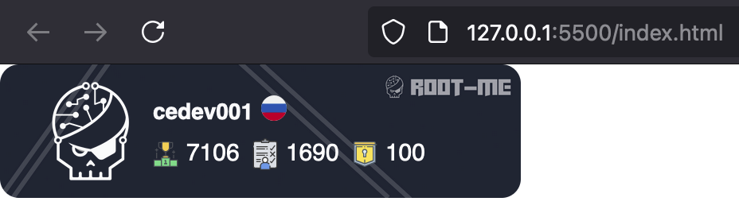

# Root-Me Badge Component

This project displays a customizable badge with user data from the Root-Me platform. It includes a backend to fetch data and a styled web component for the badge display.




## Features

- Fetches user ranking, score, and completed challenges from Root-Me.
- Interactive and styled badge component.
- Backend with Express.js using Axios and Cheerio for web scraping.

## Technologies

- **Frontend**: HTML, CSS, JavaScript (Axios for API requests).
- **Backend**: Node.js, Express.js, Cheerio.

## Setup

1. Clone the repository:
   ```bash
   git clone <repository-url>
   cd <repository-folder>

2. Install dependencies for the backend:
   ```bash
   npm install
   ```

3. Start the backend:
   ```bash
   node root-me-api.js
   ```

4. Possible


## Usage

   ```bash
    const response = await axios.get('http://localhost:3000/api/rootme/username'); // Change "username"
   ```


add this component to your website
you can use without the scraper
